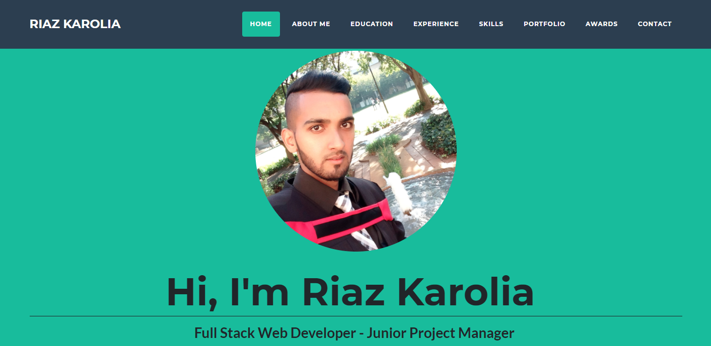
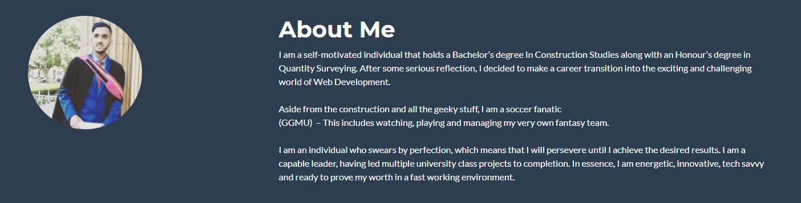
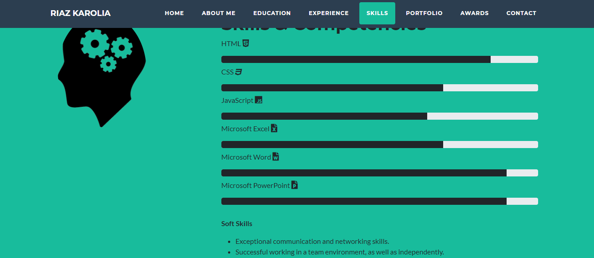
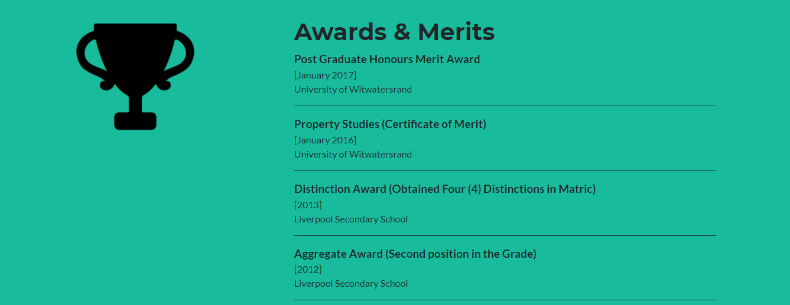
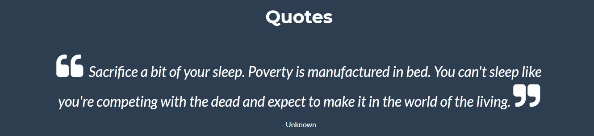

# **Riaz Karolia Resume**

> My personal resume created with Bootstrap Studio

The deployed app can be found [here](https://riazk09.github.io/Riaz_Karolia_resume/)

## Table of Contents:

- [General Information](#general-information)
- [Screenshots](#screenshots)
- [Credits](#credits)
- [Contact](#contact)

## General Information

I created my own personal webpage using Bootstrap Studio. This webpage acts as a resume as it serves to introduce me to the world quite effectively.

## Screenshots

**About Me**

**Skills**

**Awards**

**Quotes**

## Credits

- Create a Portfolio Website from Scratch using [Bootstrap Studio](https://www.youtube.com/watch?v=PhmpaA4lDFE) - by Ben Coepp
- HyperionDev - https://www.hyperiondev.com/

## Contact

👤 **Riaz Karolia**

Feel free to contact me on [LinkedIn](https://www.linkedin.com/in/riaz-karolia/)
